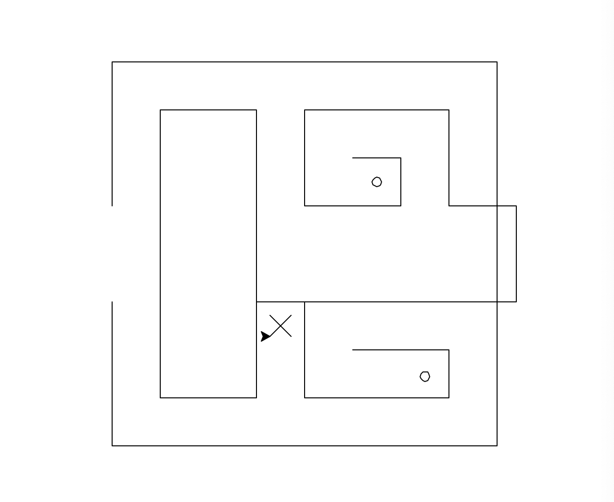
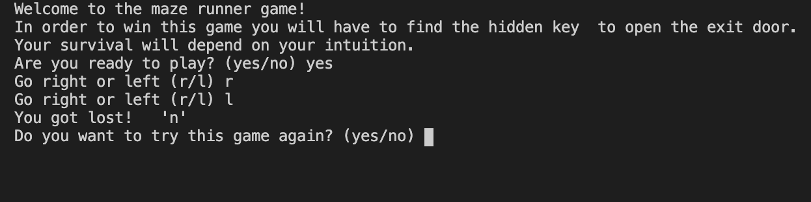
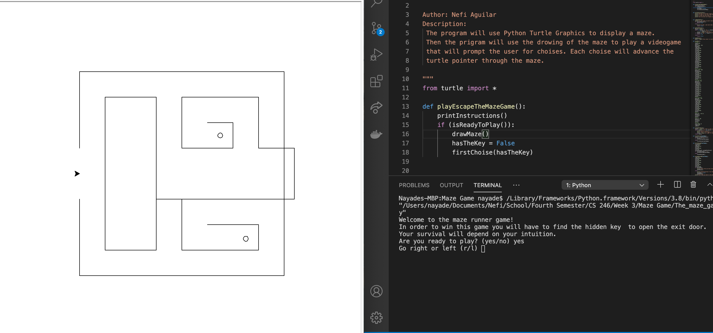

# Maze Game

## Description 
This is a basic adventure maze game writen in python.
 
 
As the user advances in the maze, the user receives prompts to go to the right or left

## Program Sample 

## Program Set Up
This program used Python </b>
Please go to https://www.python.org/downloads/
to install the latest version of Python
 
 
Also, this program requires interface to run python and display the prompts in a terminal. 
 
 
You can install VS Code or Thony to satisfy this requirement. 
 
 
VS Code download link: https://code.visualstudio.com/
 
 
Thony download link: https://thonny.org/

## Important Notes 
This program opens a new window that draws the maze and shows a pointer that indicates where you are in the maze. 
 
 
You will have to amnualy resize the application is running your program and the window that displays the game to see them on the screen at the same time. 

